# CI-MS2-fun-Quiz

- [CI-MS2-fun-Quiz](#ci-ms2-fun-quiz)
  * [User Goals](#user-goals)
  * [User Stories](#user-stories)
  * [Site Owner Goals](#site-owner-goals)
  * [Design Choices](#design-choices)
  * [Colors](#colors)
  * [Fonts](#fonts)
  * [Structure](#structure)
  * [Wireframes](#wireframes)
  * [Technologies used](#technologies-used)
  * [Features](#features)
    + [Existing features](#existing-features)
  * [Testing](#testing)
    + [HTML](#html)
    + [CSS](#css)
    + [JavaScript](#javascript)
    + [ACCESSIBILITY](#accessibility)
    + [LIGHTHOUSE](#lighthouse)
    + [Devices](#devices)
    + [Fixed errors](#fixed-errors)
  * [Bugs](#bugs)
  * [Deployment](#deployment)
  * [Credit](#credit)
    + [Content](#content)
    + [Media](#media)
  * [Acknowledgements](#acknowledgements)

<small><i><a href='http://ecotrust-canada.github.io/markdown-toc/'>Table of contents generated with markdown-toc</a></i></small>

See live version of site: https://damianjacob.github.io/CI-MS2-fun-Quiz/

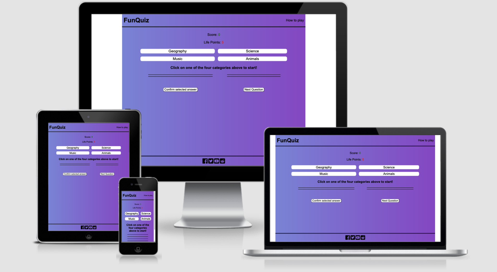
The goal of this project is to create an interactive  and responsive website that contains a quiz game. The site is targeted towards people of all ages who want to have fun and test their knowledge. 

## User Goals
1. Have fun with an interactive game
2. Test their knowledge
3. Try to beat the game
4. Follow us on social media
5. Find instructions to the game
## User Stories
1. "As a person who likes games, i expect this game to show my score and my remaining life points"
2. "As a user who has not played many online-games before, i want to see some instructions before playing"
3. "As a person interested in trivia, i want to see if i submitted the wrong response and i want to be shown the correct answer"
4. "As a user who really loves this game, i would like to follow its creator on social media to find out more about them"
5. "As a user who wants to beat the game, i expect to be able to decide myself when to go to the next question"
6. "As a gamer i expect the game to tell me when i've completed a section of it"
7. "As a user i expect to see an error message if i do something incorrectly"
8. "As a user who has different devices, i expect the site to be responsive and to work on all my devices"
9. "As a user, if i enter an incorrect address i want to be able to return to the homepage without using the back button"
10. "As a user who has many tabs open, i want to be able to recognize each site by its icon"

## Site Owner Goals
1. To have an good-looking site that incourages users to play
2. To have an clear layout and a page with instructions for the user
3. Have an intuitive interface
4. Have social media links in the site
5. Have a site that is responsive on all devices

## Design Choices
I wanted to create a site that looks fun but still clean, so i opted to go for something very minimalistic, with a very simple layout and just three main colors.
## Colors
I have chosen a linear gradient for the entire page, from left to right. The gradient goes from a dark blue to violet, which is not a drastic change. After experimenting with colors, i've decided to keep the header and footer in the same color as the rest of the page, and to separate them from the rest of tha page with a double border.
## Fonts
I used the Arial font for my page. I wanted an easily readable sans-serif font.
## Structure 

This site follows a simple structure: At the top there is a header which contains the logo of the site and a link to the "how to play" page. Immediately under the header there is the score area, which contains life points and score, two important pieces of information for the player.
We then have the four quiz categories and the interactive quiz area. In the quiz area, the player can interact with the page by choosing one of the four quiz-categories and answering questions. A correct answer will increment the score, while an incorrect question will decrease the life points. Once the user has reached 0 life points, the game is over and the user will have to start again.

On the instructions page, the game is explained in detail.

## Wireframes
I used balsamiq for the wireframes. The final wireframe is a bit different from the first version, as i made some changes while creating the project.

Wireframes for mobile

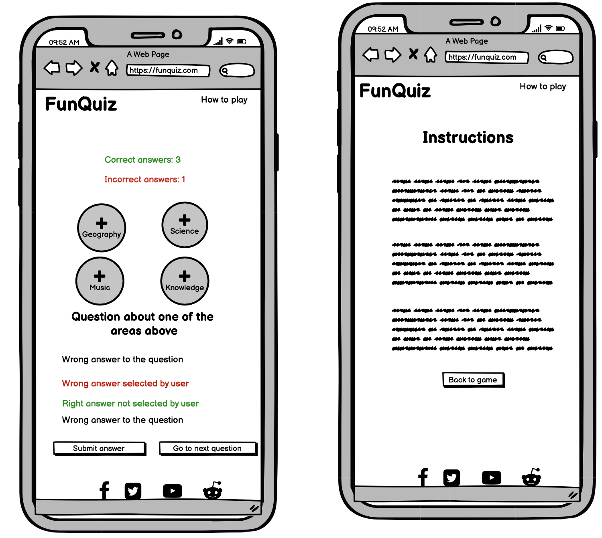

Wireframes for tablet

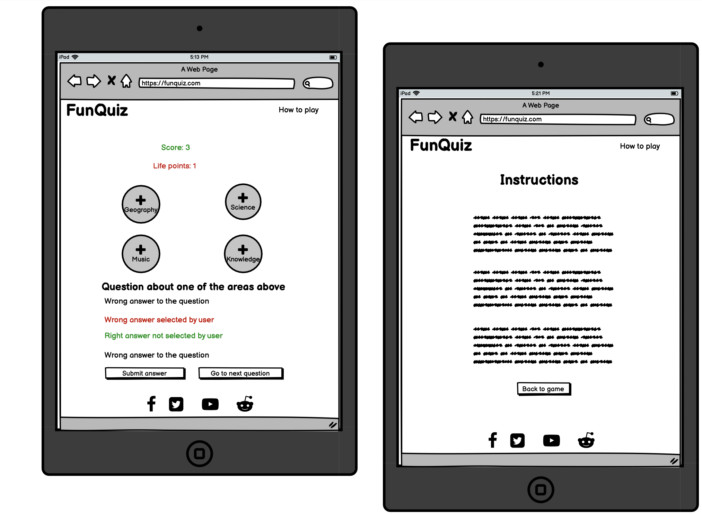

Wireframes for desktop

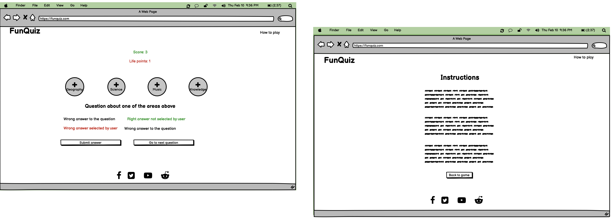

## Technologies used

I used html and css for designing the page and JavaScript for the quiz and the user interaction. For the icons i used <a href='https://fontawesome.com/'>font awesome</a>.
For creating the favicon i used https://www.favicon-generator.org/.
The favicon satisfies user story 10.

## Features
### Existing features
Nav Bar:
The nav bar is very simple and consists of the logo on the left and a link to the "how to play" page on the right side.

Screenshot of navbar

Score area:
The score area is where the user can see their score and life points. The score increases when the user answers correctly and the life points decrease when the user answers incorrectly. This feature satisfies user story 1.

Screenshot of score area

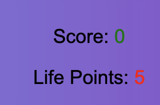

Categories:
There are four quiz categories from which the user can choose. Once the user chooses one, the buttons disappear and the user has to answer to all questions in that category before moving on to the next category.

Screenshot of categories

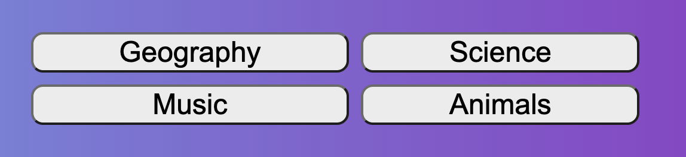

Quiz area:
The quiz area is where the user sees the question and can select their answer. After confirming the answer, the correct answer will be highlighted in green and if the user selected an incorrect answer, that one will be highlighted in red. This section satisfies user story 5.

Screenshot of quiz area

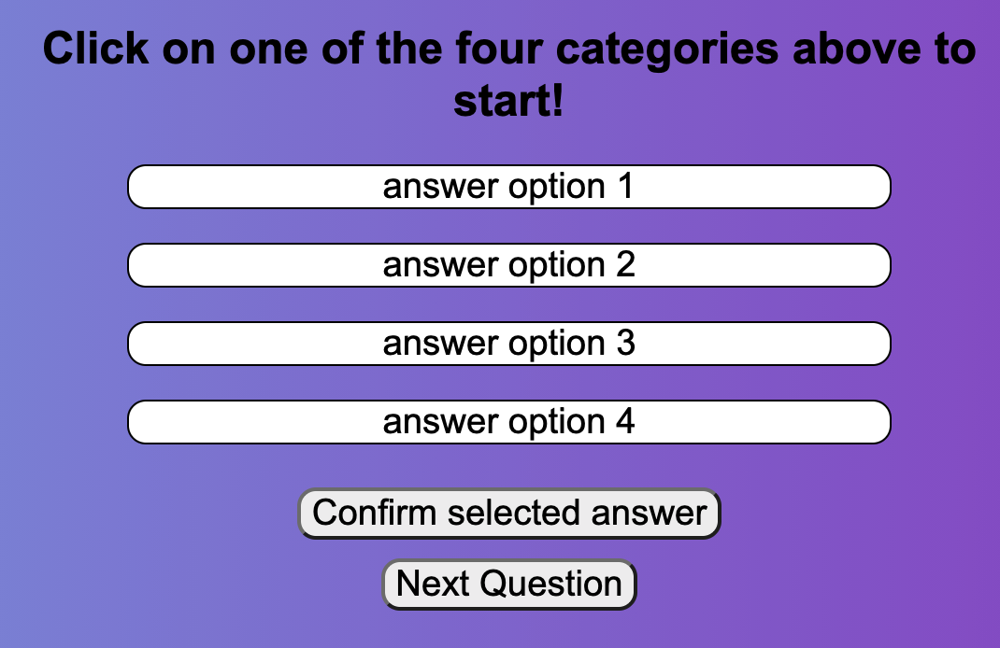

Pop up messages: 
There are different pop-up messages: for congratulating the user, indicating that the game is over or indicating that there was an error. These messages validate user stories 3, 6 and 7.

Screenshot of error message one

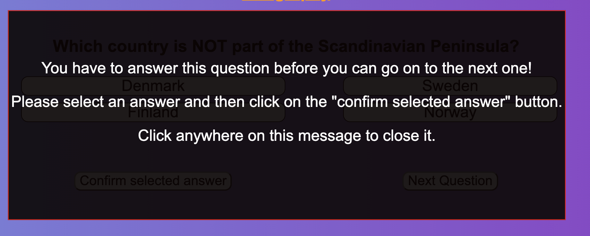

Screenshot of error message two

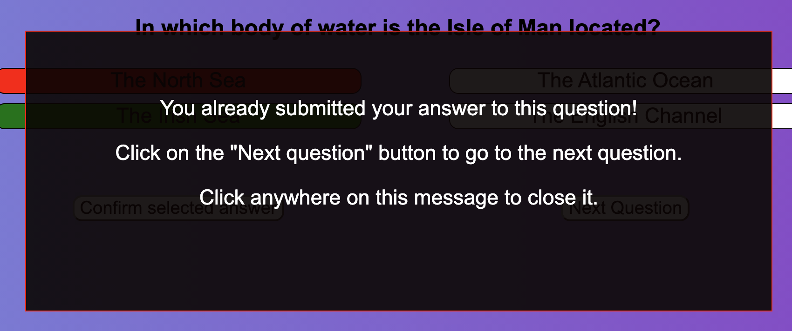

Screenshot of section completion message

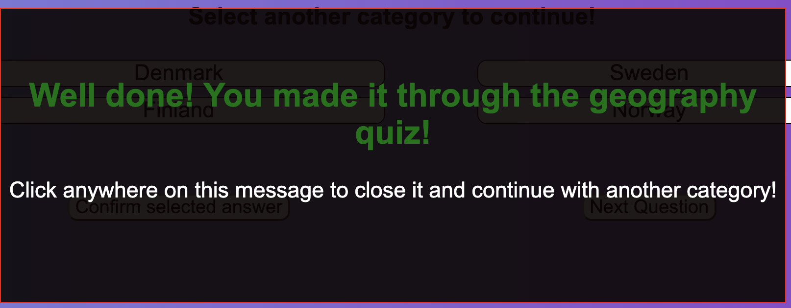

Screenshot of game over message

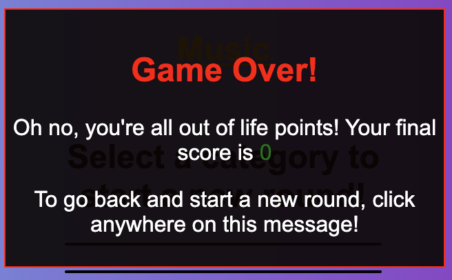

Screenshot of "you won the game" message

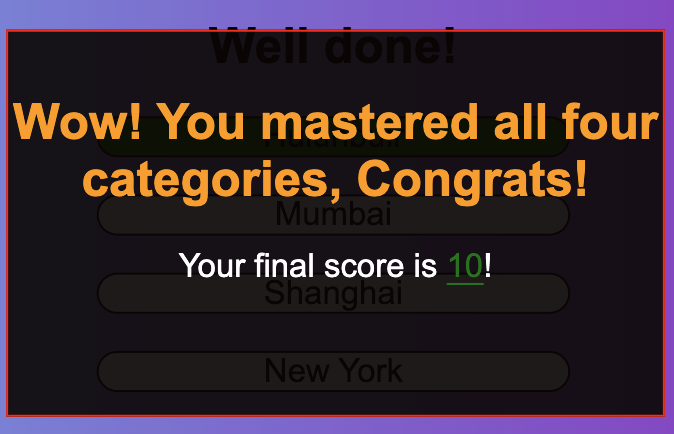

Footer: The footer is simple and contains the social media links. The social media links satisfy user storiy 4.

Screenshot of footer

Instructions page:
This page describes to the user how to play the game. It satisfies user story 2.

Screenshot of instructions page

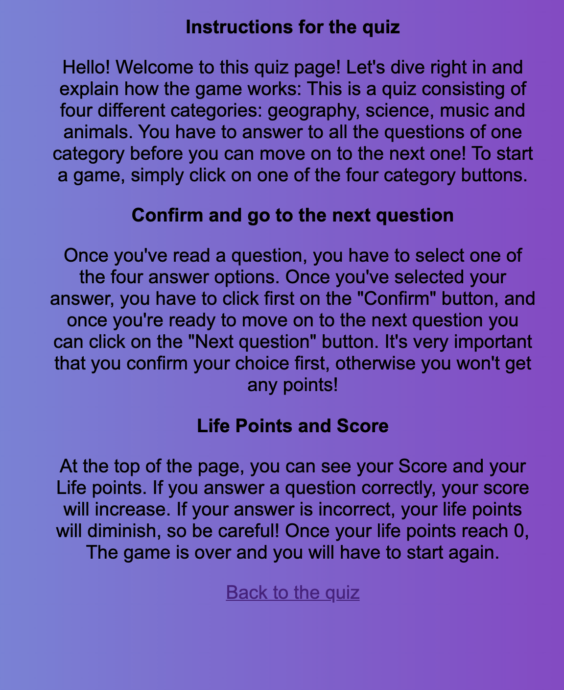

404 page: This custom 404 page directs the user back to the homepage. This satisfies user story 9.

Screenshot of 404 page

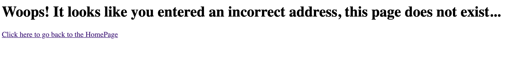

## Testing

### HTML
No errors were returned when passing through the official W3C validator

Screenshot of html validator

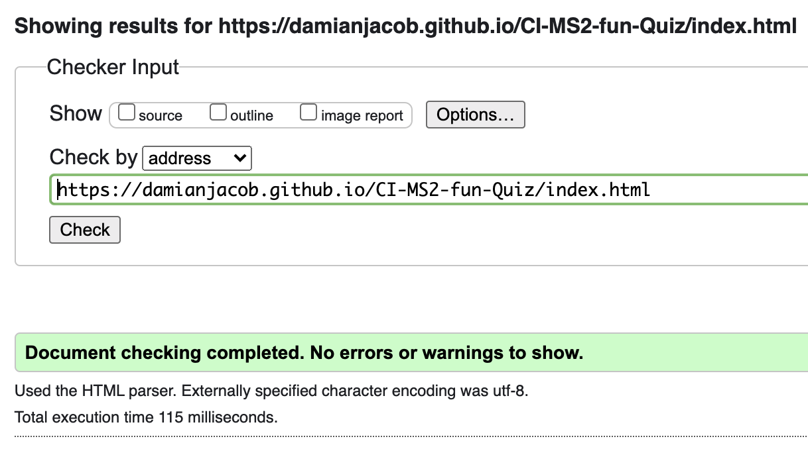

Screenshot 2 of html validator

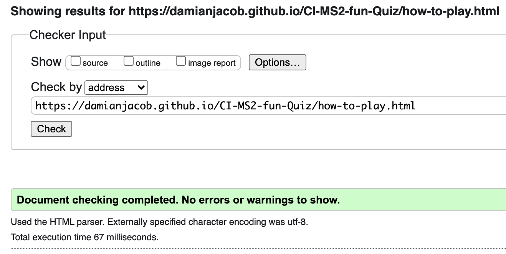

### CSS
No errors were found when passing through the official (Jigsaw) validator.
<a href='https://jigsaw.w3.org/css-validator/validator'>Go to validator</a>

Screenshot of CSS validator

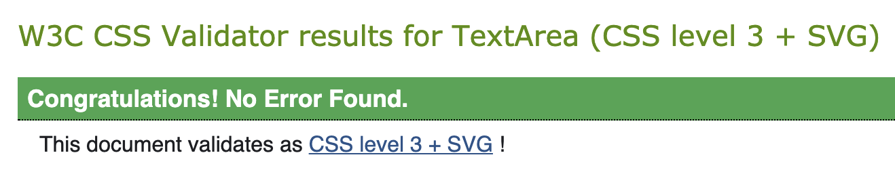

### JavaScript
There are 26 warnings in my quiz.js code. 
The second error i got was for using "for of" loops instead of "for in" loops. I tried substituting them all, but my site stopped being interactive. Since it seemed to work fine on all devices and browsers for me, i left it as it was. 
Another error I got regards functions that contain loops referring to variables declared outside of that function. I have tried to make it least confusing by declaring those variables immediately before the first function they are used in.

Screenshot of accessibility validator

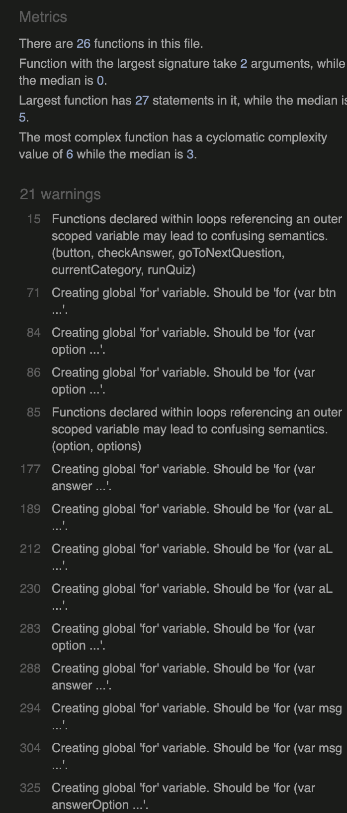

Screenshot 2 of accessibility validator

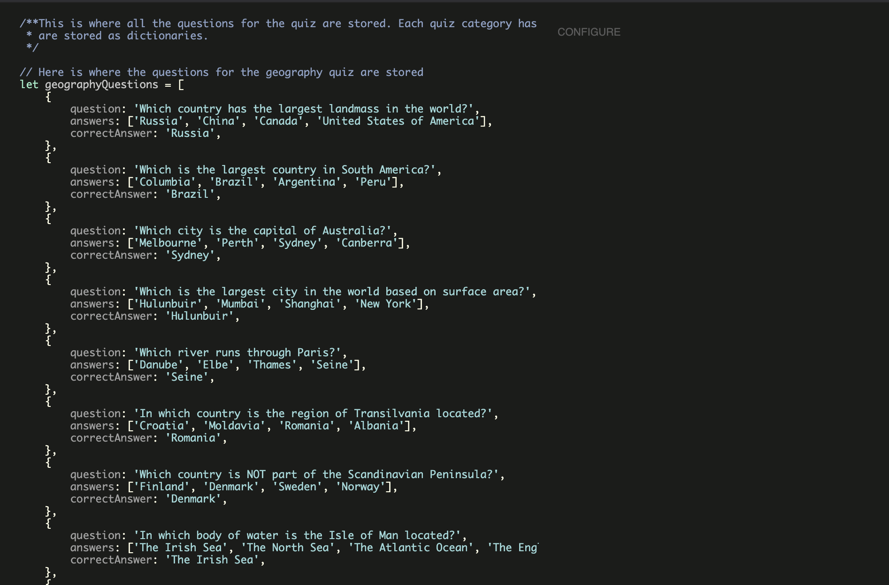

### ACCESSIBILITY
There were no violations regarding accessibility.

Screenshot of accessibility validator

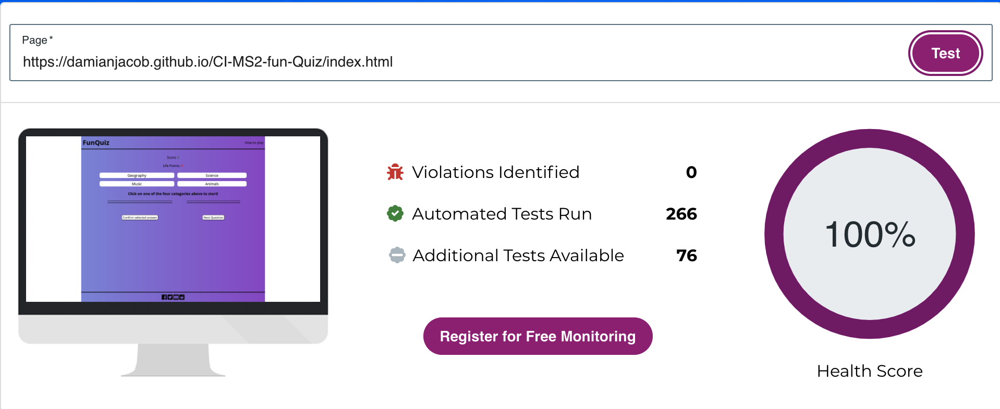

Screenshot 2 of accessibility validator

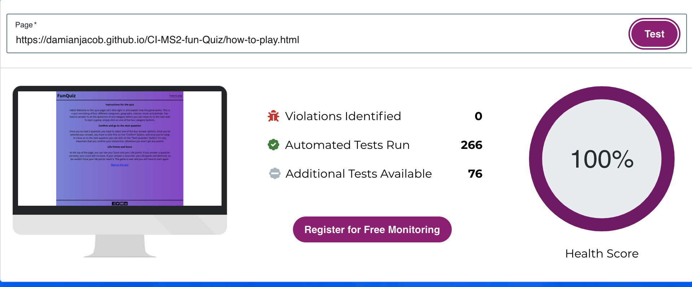

### LIGHTHOUSE

Screenshot of lighthouse test

Screenshot 2 of lighthouse test

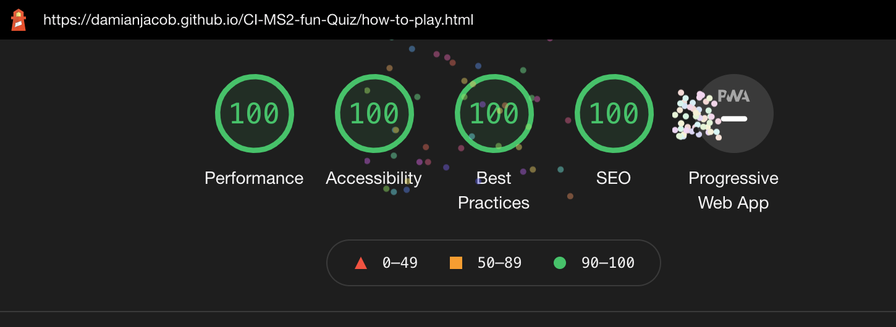

### Devices
The site has been tested without issues on the following devices:
- MacMini: Mozilla Firefox, Google Chrome, Safari
- iPad: Safari, Google Chrome
- iPhone 11 Pro Max: Safari, Google Chrome

### Fixed errors
- HMTL: I deleted the alt attribute from the i elements.
- JavaScript: There were many missing semicolons when i first validated my JS code, which i provided to amend.

## Bugs

Using JavaScript for the first time was definitely a challenge, and i had to fix many a bug by using the dev tools console. At the beginning i had forgotten that to access css rules with javascript, it's necessary to use .style before the attribute name we want to change.
Other bugs:
- Footer: my footer content was not centered vertically, the icons overflowed over the bottom of the footer. After trying different solutions, i found that the simplest and most effective was to use "align-items: center" since the footer has the display set to flex.
- Grids: The grid's content in both the category area and the quiz area were not behaving as i expected, with the single elements going in a different order than i wanted. I resolved this by specifying the row and column of these elements where necessary.
- In order to check if the user is not submitting the same answer twice, i created two variables: timesAnswerChecked, which measures how many times the user checked an answer and questionArrayIndex, which is assigned to a function that returns the index of the current question in the current answer array.
They were supposed to be equal, and if they weren't an error message would display, but instead the error message would display always. After a while i realised that there was a simple reason: the index variable would always be larger by 1 because timesAnswerChecked only increased AFTER clicking on the "check answer" button. The simple solution was to check whether timesAnswerChecked was equal to the index minus 1.
- At the very end i noticed that after finishing a category and clicking on a new one would not change the answer options but only the question. The cause was the variable categoryTitle, so i deleted that variable and wrote it's value in most instances where i had used that variable.

## Deployment
The site was deployed to Github pages. See the live link: https://damianjacob.github.io/CI-MS2-fun-Quiz/index.html

## Credit

### Content
   I often referred back to various lessons from Code Institute and to W3schools or MDN.

### Media
   The icons have been taken from font awesome.

## Acknowledgements
I would like to thank my co-students who took their time to answer my questions or doubts on Slack, my mentor Mo Shami who gave me precious advice and lent me his expertise and the tutors of Code Institute who are always helpful.