# CI-MS2-fun-Quiz
https://damianjacob.github.io/CI-MS2-fun-Quiz/

- [CI-MS2-fun-Quiz](#ci-ms2-fun-quiz)
  * [User Goals](#user-goals)
  * [User Stories](#user-stories)
  * [Site Owner Goals](#site-owner-goals)
  * [Design Choices](#design-choices)
  * [Colors](#colors)
  * [Fonts](#fonts)
  * [Structure](#structure)
  * [Wireframes](#wireframes)
  * [Technologies used](#technologies-used)
  * [Features](#features)
    + [Existing features](#existing-features)
  * [Testing](#testing)
    + [HTML](#html)
    + [CSS](#css)
    + [ACCESSIBILITY](#accessibility)
    + [LIGHTHOUSE](#lighthouse)
    + [Fixed errors](#fixed-errors)
  * [Bugs](#bugs)
  * [Deployment](#deployment)
  * [Credit](#credit)
    + [Content](#content)
    + [Media](#media)
  * [Acknowledgements](#acknowledgements)

<small><i><a href='http://ecotrust-canada.github.io/markdown-toc/'>Table of contents generated with markdown-toc</a></i></small>

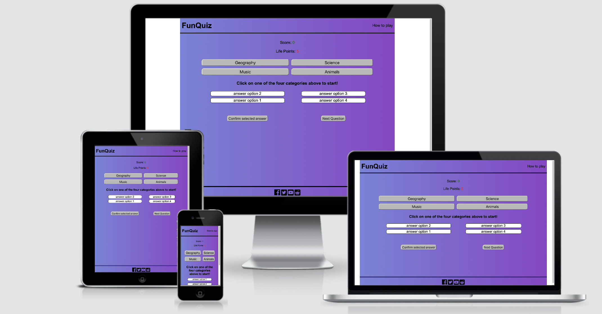
The goal of this project is to create an interactive website that contains a quiz game. The site is targeted towards people of all ages who want to have fun and test their knowledge.

## User Goals
1. Have fun with an interactive game
2. Test their knowledge
3. Try to beat the game
4. Follow us on social media
5. Find instructions to the game
## User Stories
1. "As a person who likes games, i expect this game to show my score and my remaining life points"
2. "As a user who has not played many online-games before, i want to see some instructions before playing"
3. "As a person interested in trivia, i want to see if i submitted the wrong response and i want to be shown the correct answer"
4. "As a user who really loves this game, i would like to follow its creator on social media to find out more about them"
5. "As a user who wants to beat the game, i expect to be able to decide myself when to go to the next question"
6. "As a gamer i expect the game to tell me when i've completed a section of it"
## Site Owner Goals
1. To have an good-looking site that incourages users to play
2. To have an clear layout and a page with instructions for the user
3. Have an intuitive interface
4. Have social media links in the site
5. Have a site that is responsive on all devices

## Design Choices
I wanted to create a site that looks fun but still clean.
## Colors
I have chosen a linear gradient for the entire page, from left to right. The gradient goes from a dark blue to violet, which is not a drastic change. After experimenting with colors, i've decided to keep the header and footer in the same color as the rest of the page, and to separate them from the rest of tha page with a double border.
## Fonts
I used the Arial font for my page. I wanted an easily readable sans-serif font.
## Structure 

This site follows a simple structure: At the top there is a header which contains the logo of the site and a link to the "how to play" page. Immediately under the header there is the score area, which contains life points and score, two important pieces of information for the player.
We then have the four quiz categories and the interactive quiz area. In the quiz area, the player can interact with the page by choosing one of the four quiz-categories and answering questions. A correct answer will increment the score, while an incorrect question will decrease the life points. Once the user has reached 0 life points, the game is over and the user will have to start again.

On the instructions page, the game is explained in detail.

## Wireframes
I used balsamiq for the wireframes. The final wireframe is a bit different from the first version, as i made some changes while creating the project.
<!-- ADD WIREFRAME IMAGES HERE -->

Wireframes for mobile

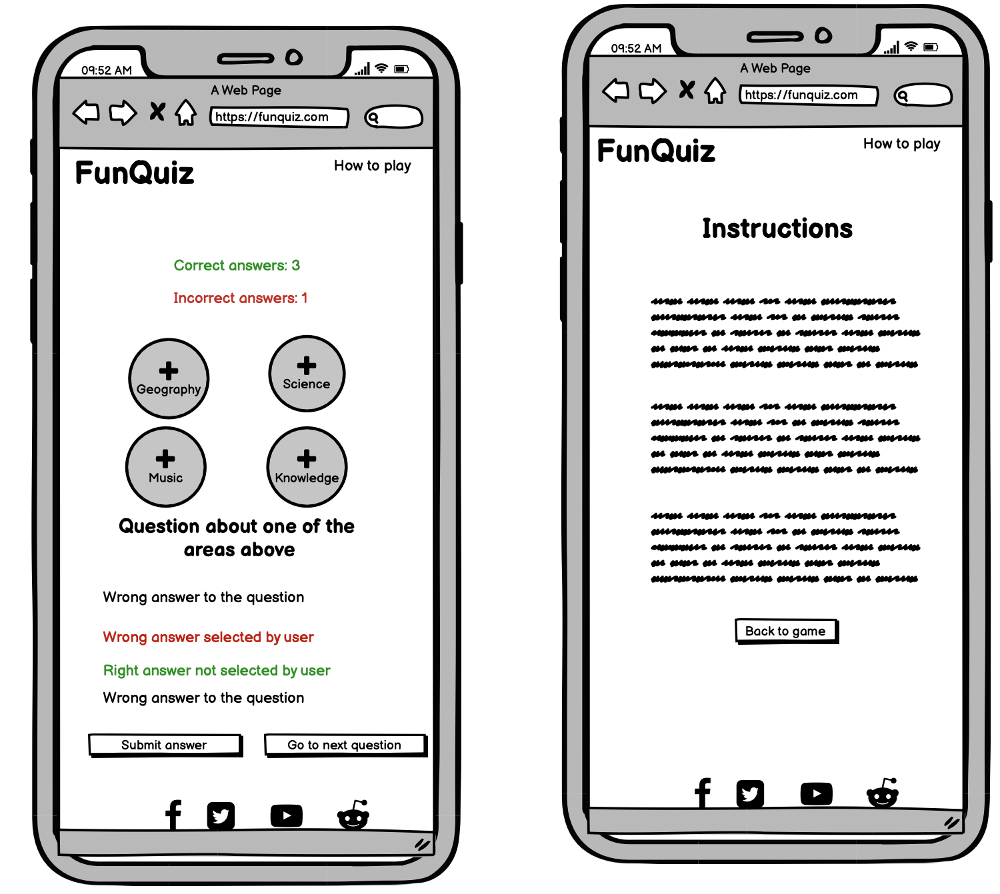

Wireframes for tablet

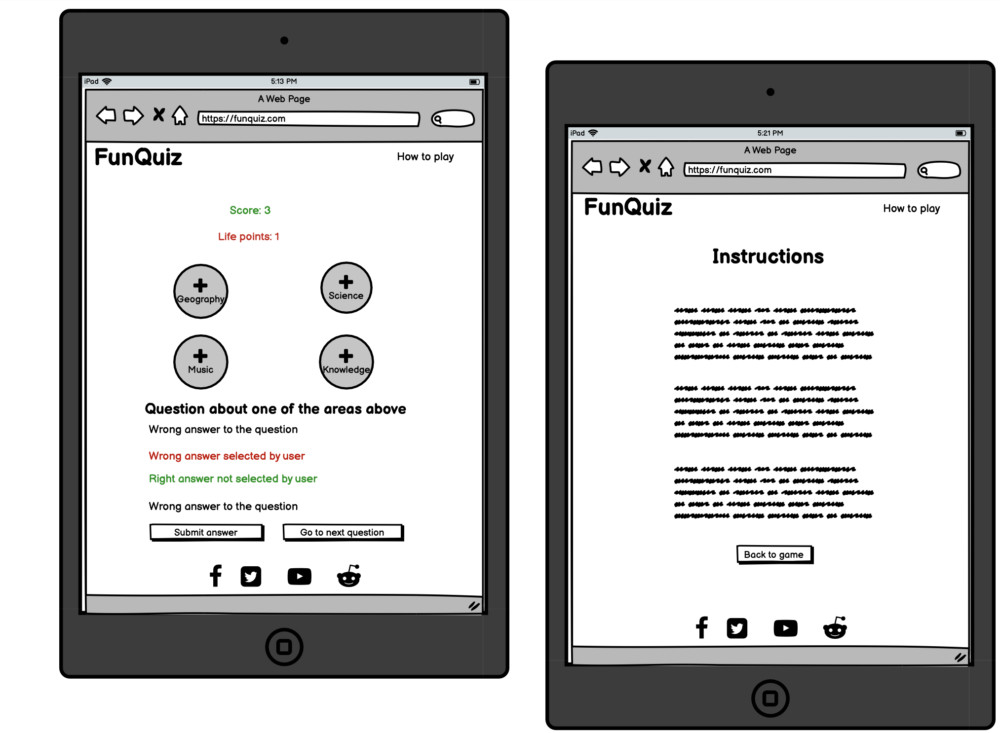

Wireframes for desktop

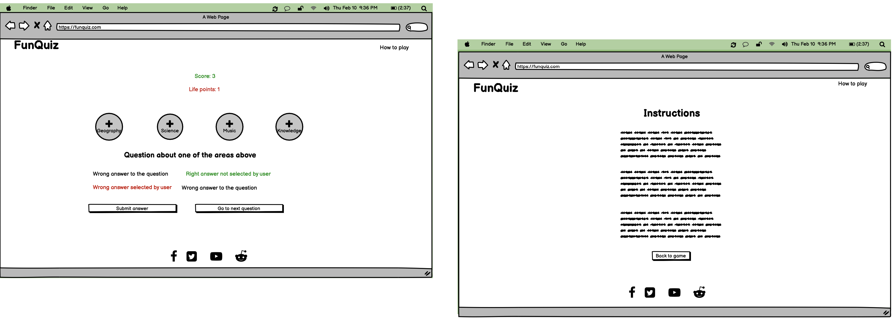

## Technologies used

I used html and css for designing the page and JavaScript for the quiz and the user interaction. For the icons i used <a href='https://fontawesome.com/'>font awesome</a>.

## Features
### Existing features
<!-- ADD DROPDOWN IMAGES FOR ALL FEATURES -->
- Nav Bar
 The nav bar is very simple and consists of the logo on the left and a link to the "how to play" page on the right side.

Screenshot of navbar

- Score area
  The score area is where the user can see their score and life points. The score increases when the user answers correctly and the life points decrease when the user answers incorrectly.

Screenshot of score area

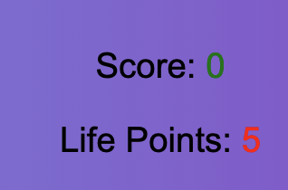

- Categories
 There are four quiz categories from which the user can choose. Once the user chooses one, the buttons disappear and the user has to answer to all questions in that category before moving on to the next category.

Screenshot of categories

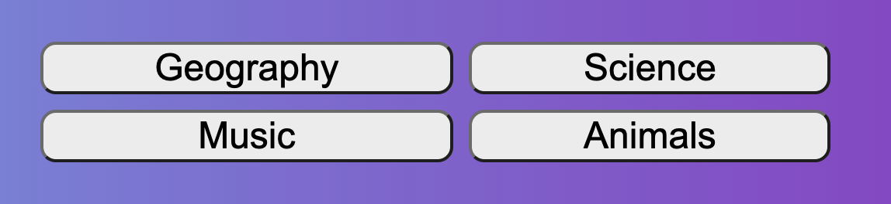

- Quiz area
 
The quiz area is where the user sees the question and can select their answer. After confirming the answer, the correct answer will be highlighted in green and if the user selected an incorrect answer, that one will be highlighted in red.

Screenshot of quiz area

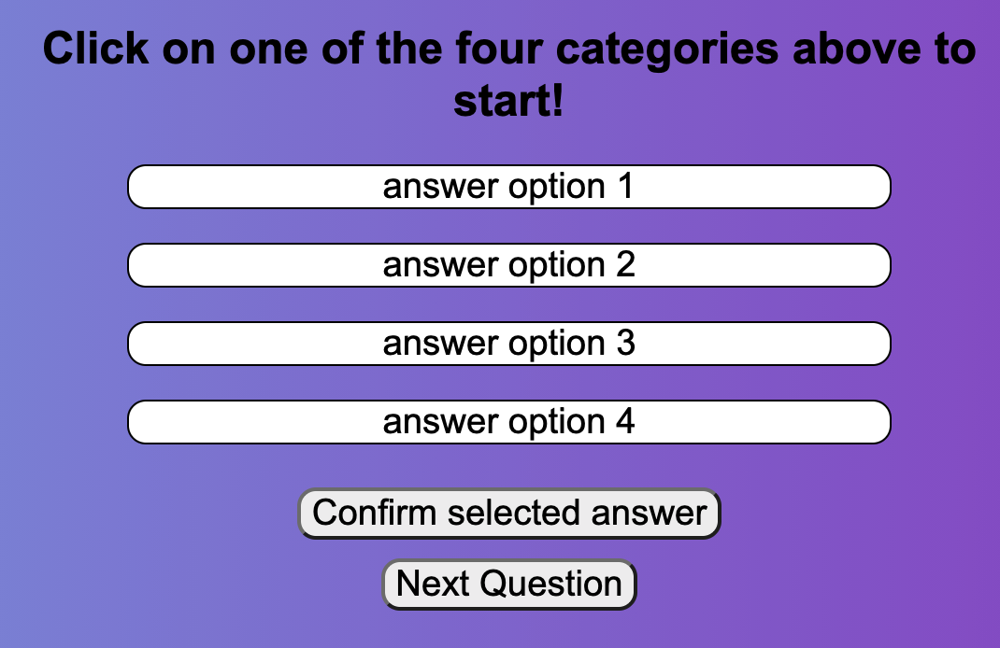

- Pop up messages
 
There are different pop-up messages: for congratulating the user, indicating that the game is over or indicating that there was an error.

Screenshot of error message

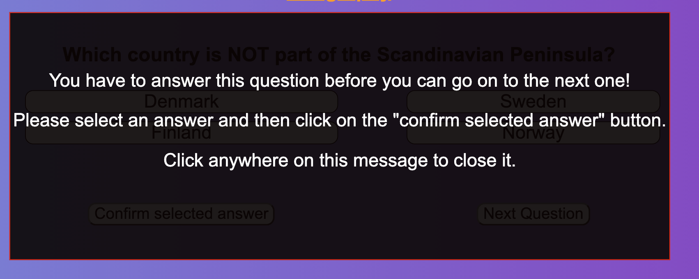

Screenshot of game over message

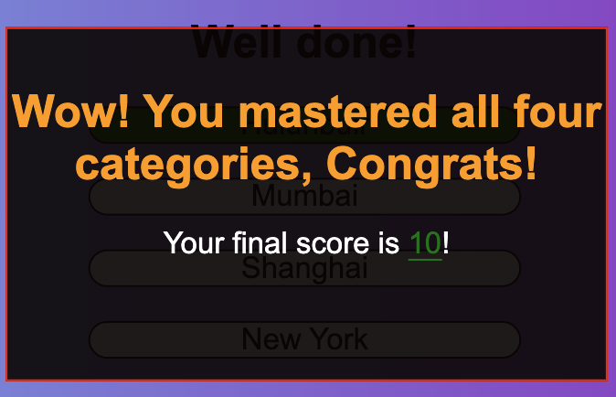

Screenshot of "you won the game" message

- Footer
  The footer is simple and contains the social media links.

Screenshot of footer

## Testing

### HTML
No errors were returned when passing through the official W3C validator

Screenshot of html validator

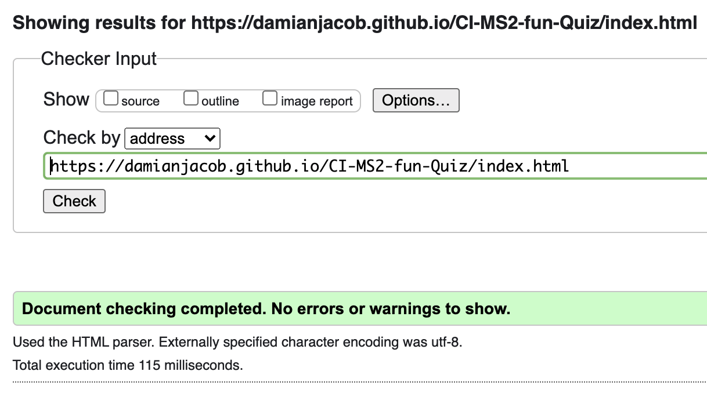

Screenshot 2 of html validator

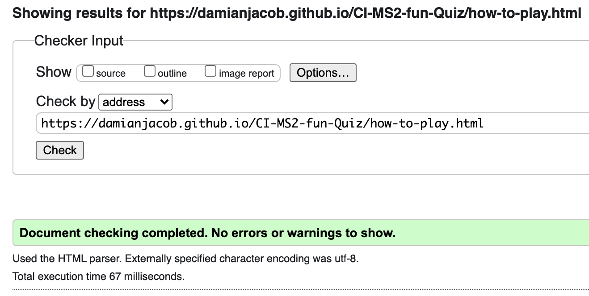

### CSS
No errors were found when passing through the official (Jigsaw) validator.
<a href='https://jigsaw.w3.org/css-validator/validator'>Go to validator</a>

Screenshot of CSS validator

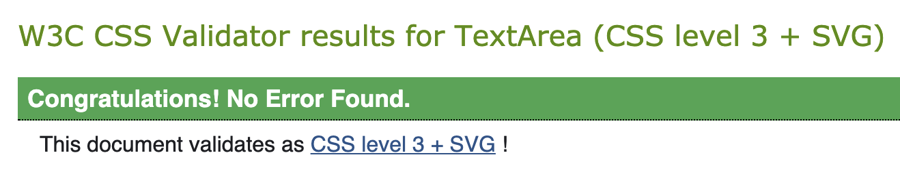

### ACCESSIBILITY
There were no violations regarding accessibility.

Screenshot of accessibility validator

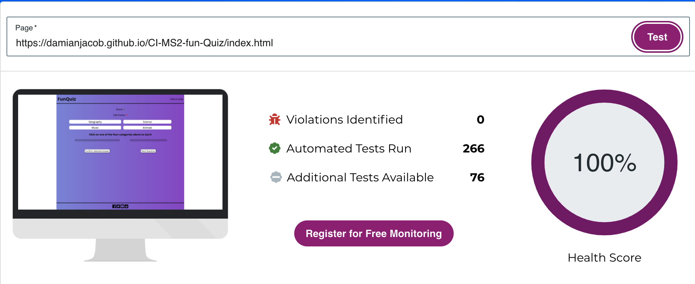

Screenshot 2 of accessibility validator

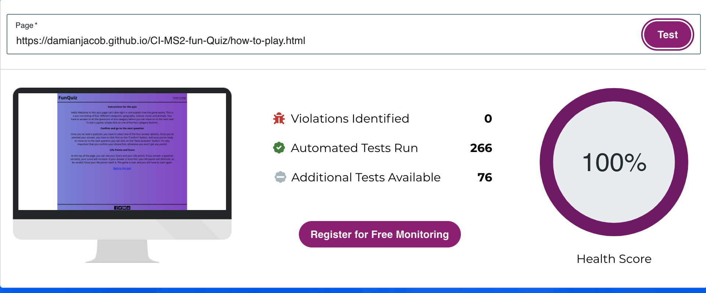

### LIGHTHOUSE

Screenshot of lighthouse test

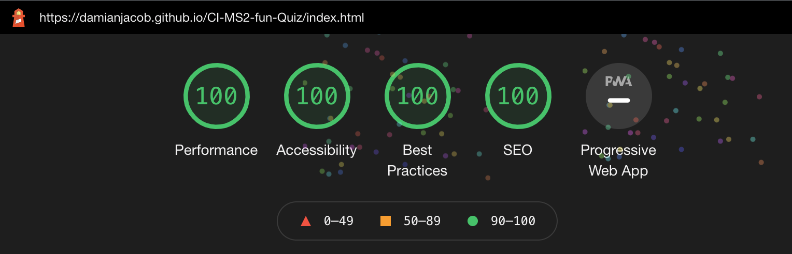

Screenshot 2 of lighthouse test

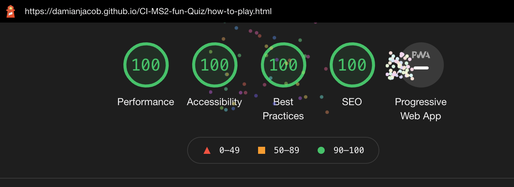

### Fixed errors
The only error i had to fix during testing was removing the "alt" attribute from the i elements.

## Bugs

Using JavaScript for the first time was definitely a challenge, and i had to fix many a bug by using the dev tools console. At the beginning i had forgotten that to access css rules with javascript, it's necessary to use .style before the attribute name we want to change.

## Deployment
The site was deployed to Github pages. See the live link: https://damianjacob.github.io/CI-MS2-fun-Quiz/index.html

## Credit

### Content
   I often referred back to various lessons from Code Institute and to W3schools or MDN.

### Media
   The icons have been taken from font awesome.

## Acknowledgements
I would like to thank my co-students who took their time to answer my questions or doubts on Slack, my mentor Mo Shami who gave me precious advice and lent me his expertise and the tutors of Code Institute who are always helpful.